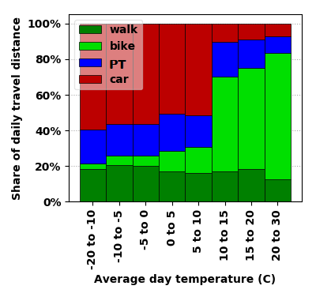
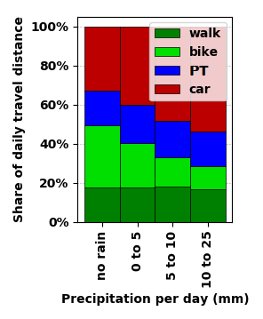
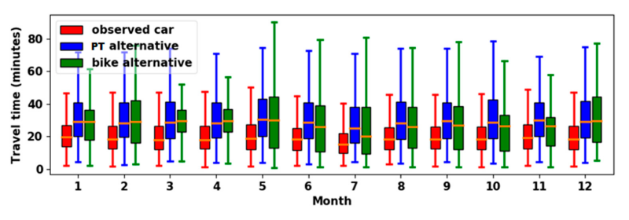
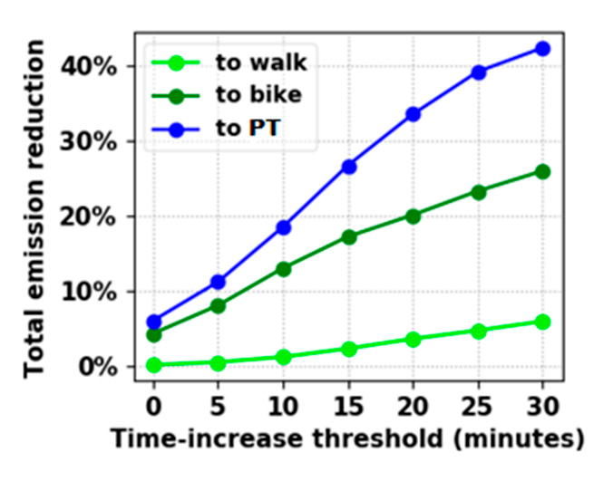
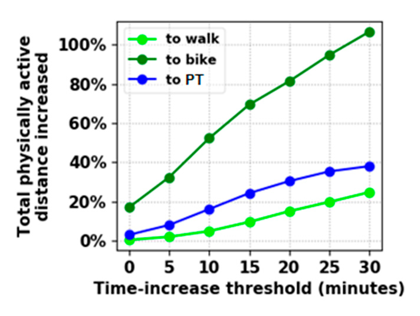
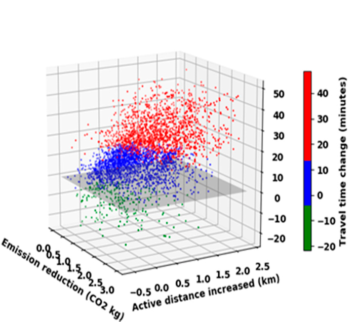
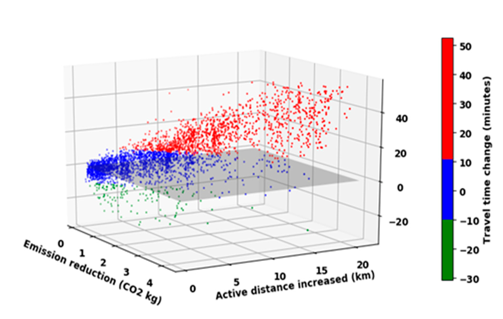

# Travel Behavior and Modal-shift Analysis using Mobile Data

## Description
This is a prototype of a computational framework to analyze daily urban mobility and the potential of shifting from car to public transport, bike and walk. The ongoing mobility pattern in the target city is inferred from anonymous long-term GPS traces. The potential future mobility pattern is computed using route planning algorithms, particularly via OpenTripPlanner together with online public transport API.

Three main interrelated factors to analyze:
1. Travel-time, 2. Carbon emission, 3. Distance traveled with bike or by walking (Physically-active distance)

It is also possible to dig into several other factors.

### Example Outputs based on the data collected in Helsinki

Observed travel patterns vs. Temperature | Observed travel patterns vs. Precipitation
------------ | -------------
 | 
(PT = Public Transportation)

Observed vs Potential future patterns |
------------ |
 |
(PT = Public Transportation)

Potential future CO2 reduction | Potential future increase in physicall activity
------------ | ------------
 | 
(PT = Public Transportation)

Potential future outcome by shifting to public transport | Potential future outcome by shifting to bike
------------ | ------------
 | 

## Use, Contribute, and Extend!
Pull requests are welcome!

Contact for questions: bagheri_mehrdad@hotmail.com

Please acknowledge and cite this repository if you use the code. 

I hope this repository inspires further development in the field of Smart Mobility and Data Analysis for Intelligent Transportation.

## How to Use
If you plan to test this whole repository for your project: 

1. Start by running either *run_update_from_new_legs.py* or *run_update_from_new_legs_parallel.py*:

Detects full door-to-door trips from the input trip-segments, and then computes alternative paths for those trips using different modes of transport (i.e. public transport, bike, and walk).

*run_update_from_new_legs_parallel.py* considerably speeds up the process when you have a large amount of data.

2. Run *run_session_prepare_data.py* e.g. in your Spyder IDE:

Gets the essential variables and datasets ready for further analysis and visualization.

All the loaded and filtered data goes into one global object: *session_data_global*

*session_data_global* object contains:

- observed_trips: The result of trip extraction from the recorded legs.
                mainmode is the transportation mode that makes at least 70% of the total travel distance of the trip
                Check other important attributes, that are self explanatory by their name.

- computed_trips: The results parsed and saved from OTP queries
                ...

- deltas: The result of comparing computed trips with the observed trips.
              ...

- daily_weather_...:         

3. Use the session data as you wish. 

You can write your own visualization code and also use plotting functions already available in the 'tslib' package. 

## Code Guide
The 'tslib' package contains handy modules for analysis of trip-segments, advanced visualization, etc. These modules have been imported and used throughout the code.

The 'dal' package contains all the SQL code and database interface.

The 'commonlayer' package contains HTTP REST API code.

The important 'pyfiles.common.otp_trip_planner' module uses OpenTripPlanner (OTP) to compute detailed origin-destination trip paths according to the desired mode of transportation.
OTP is a powerful tool but can be tricky to use. See how it is used in this repository for tips and tricks and to get ideas. The code is faily documented.

